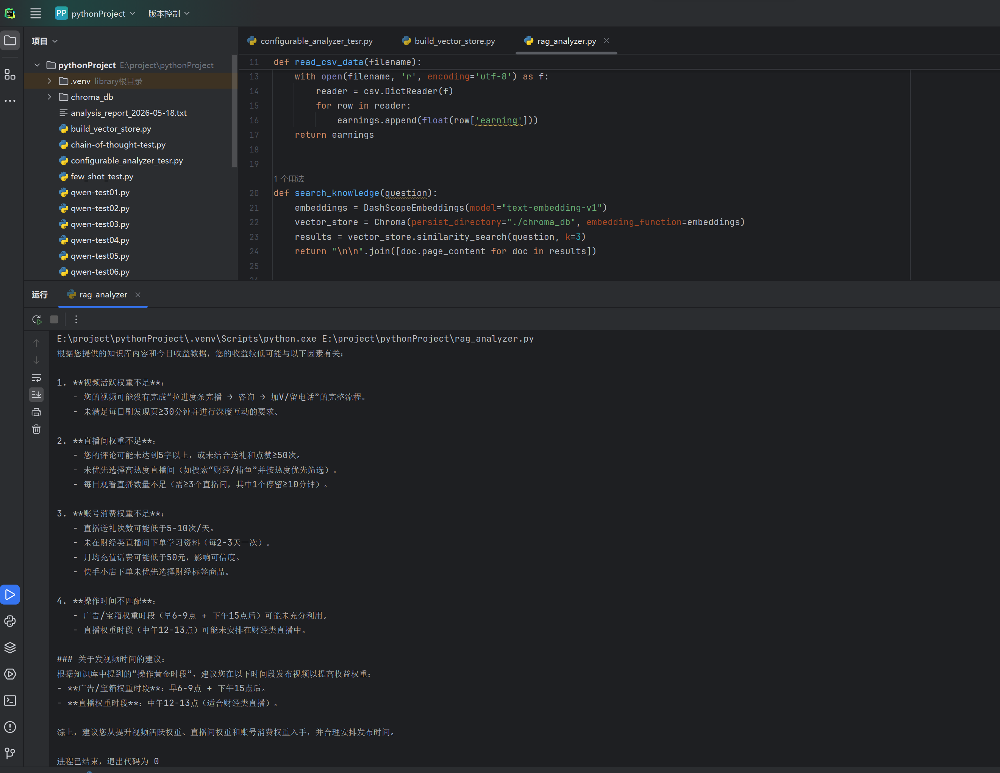

# 快手收益智能分析助手 (Kuaishou RAG Analyzer)

## 📌 介绍

这是一个基于 **RAG（检索增强生成）** 的智能分析工具。它能读取我每天记录的快手收益数据，从我整理的运营知识库中检索相关策略，并调用大模型生成一份包含**数据分析和可执行建议**的报告。

## 🎯 项目动机
我每天都在快手极速版上花时间，但收益忽高忽低。手动记录无法看清问题根源，于是我决定用技术解决自己的真实需求。这个项目是 **“用 AI 解决实际问题”** 的完整实践，也让我深入掌握了 RAG 应用的开发流程。

## ✨ 核心功能
- **数据读取**：自动读取 CSV 格式的每日收益数据。
- **灵活分析**：支持**零样本、少样本、思维链**三种提示词策略，可按需切换（见 `configurable_analyzer_tesr.py`）。
- **RAG 增强分析**：基于我收集的快手运营知识库（`knowledge_base/` 文件夹）进行检索，让 AI 的回答有据可依，减少“瞎编”。
- **多模式输出**：可输出详细分析报告，也可输出格式化的短答案，便于程序解析。

## 🛠️ 技术栈
- **语言**: Python 3.12.10
- **大模型 API**: 阿里云 通义千问 (DashScope)
- **RAG 框架**: LangChain + Chroma 向量数据库
- **Embedding 模型**: text-embedding-v1

## 🗂️ 项目文件说明
| 文件                            | 作用                                       |
| ------------------------------- | ------------------------------------------ |
| `rag_analyzer.py`               | 主程序：实现 RAG 检索 + 大模型调用         |
| `build_vector_store.py`         | 工具脚本：将知识库文档切片并存入向量数据库 |
| `configurable_analyzer_tesr.py` | 演示三种提示词策略（零样本/少样本/思维链） |
| `knowledge_base/`               | 快手运营知识库（.txt 文档）                |

## 🚀 如何运行

```bash
# 1. 安装依赖
pip install -r requirements.txt

# 2. 配置 API Key (需自行注册阿里云百炼)
# 在系统环境变量中设置 DASHSCOPE_API_KEY

# 3. 构建向量数据库 (首次运行)
python build_vector_store.py

# 4. 运行分析
python rag_analyzer.py
```

## 📈 示例输出

